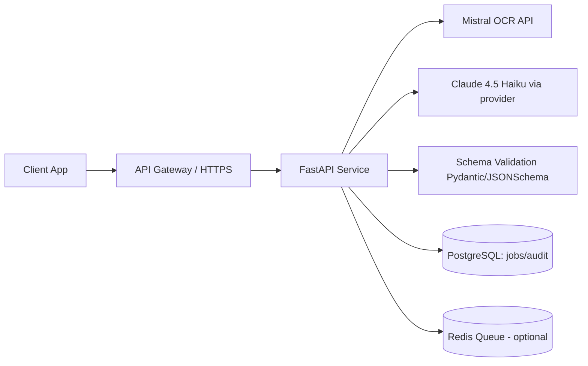

# Technology And Deployment Choices (API CV Parsing)

## 1) Goal
Build one production API endpoint that receives a CV file (`pdf`, `png`, `jpg`, `jpeg`, `docx`) and returns a structured JSON profile.

Decision baseline from your benchmark exports:
- OCR winner (quality-first): `Mistral OCR 3`
- LLM parsing winner: `Claude 4.5 Haiku`
- Recommended stack for endpoint: `Mistral OCR 3` + `Claude 4.5 Haiku`

Files used for this decision:
- `exports/ANALYSE_DECISIONNELLE.md`
- `exports/benchmark_recommendation.json`
- `exports/analysis_tables/ocr_decision_scorecard.csv`
- `exports/analysis_tables/llm_decision_scorecard.csv`

## 2) Technology Options (and why)

### API framework
1. `FastAPI` (recommended)
- Why: strong typing, validation with Pydantic, built-in OpenAPI docs, easy async handling.
- Risk: low.

2. `Flask`
- Why: simple.
- Limit: less native schema-first and async ergonomics vs FastAPI.

### Runtime and packaging
1. `Python 3.11+` + `Docker` (recommended)
- Why: reproducible deploy, easy cloud portability, stable dependency control.
- Risk: low.

### Queue/background processing
1. `Redis + Celery/RQ` (recommended when async jobs enabled)
- Why: OCR + LLM can exceed HTTP timeout; queue gives reliability/retry/control.
- Risk: moderate ops overhead.

2. In-process background task only
- Why: simpler start.
- Limit: weaker reliability/scaling under load.

### Persistence
1. `PostgreSQL` for job metadata/audit (recommended for prod)
- Why: durable status history, traceability, debug support.

2. No DB (stateless only)
- Why: fast MVP.
- Limit: no durable tracking, weaker observability.

### Secrets
1. Cloud Secret Manager / managed secrets (recommended)
- Why: secure rotation, no plain keys in files.

## 3) Deployment Platforms (where to deploy and why)

### Option A: Google Cloud Run (recommended default)
- Best for: production with low ops burden.
- Pros:
  - Native Docker deploy
  - Autoscaling to zero
  - Managed HTTPS and IAM
  - Easy Secret Manager integration
  - Good fit for API + optional worker services
- Cons:
  - Cloud learning curve if team is new to GCP

### Option B: Render / Railway
- Best for: fast demo and early MVP.
- Pros:
  - Very quick setup
  - Simple UI-based deployment
- Cons:
  - Less control on enterprise policies/networking
  - May become limiting at higher scale/compliance levels

### Option C: AWS ECS Fargate
- Best for: enterprise AWS-first organizations.
- Pros:
  - Strong integration in AWS ecosystems
  - Scalable and production-grade
- Cons:
  - More setup/ops complexity than Cloud Run

## 4) Recommended Target Architecture

### Operating modes
1. `Synchronous` (simple)
- `POST /v1/parse-cv` returns final JSON in one request.
- Use only for small documents and low traffic.

2. `Asynchronous` (recommended for production)
- `POST /v1/jobs` creates a job.
- Worker runs OCR + parsing.
- `GET /v1/jobs/{job_id}` returns status/result.
- Better for long-running documents and high reliability.

## 5) Final Technology Decision (recommended)
1. API: `FastAPI`
2. Container: `Docker`
3. OCR: `Mistral OCR 3`
4. LLM parsing: `Claude 4.5 Haiku`
5. Validation: `Pydantic + JSON Schema`
6. Deployment: `Cloud Run` (API service), optional second worker service
7. Secrets: `Secret Manager`
8. Observability: structured logs + request/job IDs + latency/error metrics

Why this is the best trade-off for your project:
- It matches your benchmark winners.
- It minimizes time-to-production.
- It keeps a clear path from MVP to robust production.
- It supports strict JSON quality and traceability.

## 6) Practical Decision Tree
1. Need production in <1 week with minimal ops?
- Choose: `Cloud Run + FastAPI + sync endpoint first`, then add async jobs.

2. Need strong long-document reliability now?
- Choose: `Cloud Run + FastAPI + Redis queue + async job endpoints`.

3. Already fully AWS-based company?
- Choose: `ECS Fargate` with same API design and same OCR/LLM stack.

## 7) Non-functional targets (recommended)
- P95 latency (sync small docs): `< 15s`
- Job success rate: `>= 99%` (async mode)
- JSON schema validity rate: `>= 99%`
- Full request tracing with unique `job_id` and `request_id`

## 8) Security baseline
- Do not store API keys in repository files.
- Rotate compromised keys immediately.
- Enforce auth (`Bearer token` or service-to-service IAM).
- Add input file limits (size/page count/type whitelist).
- Redact PII in logs.
